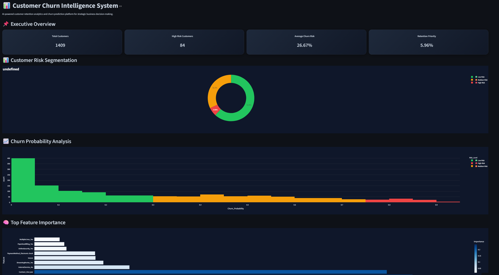
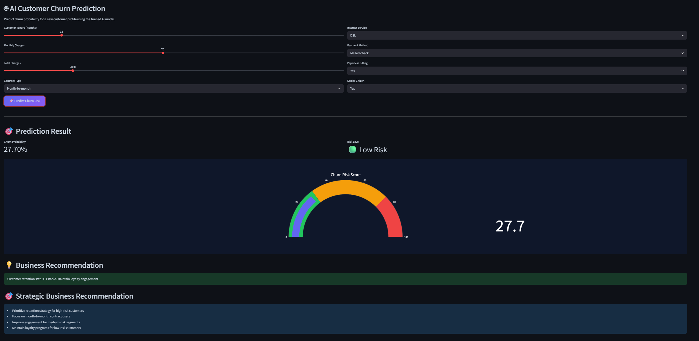
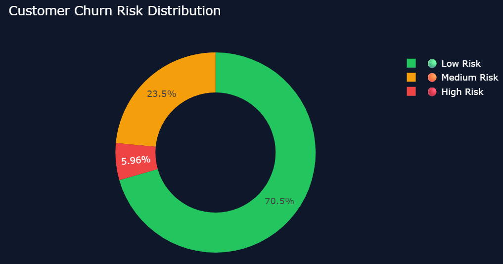
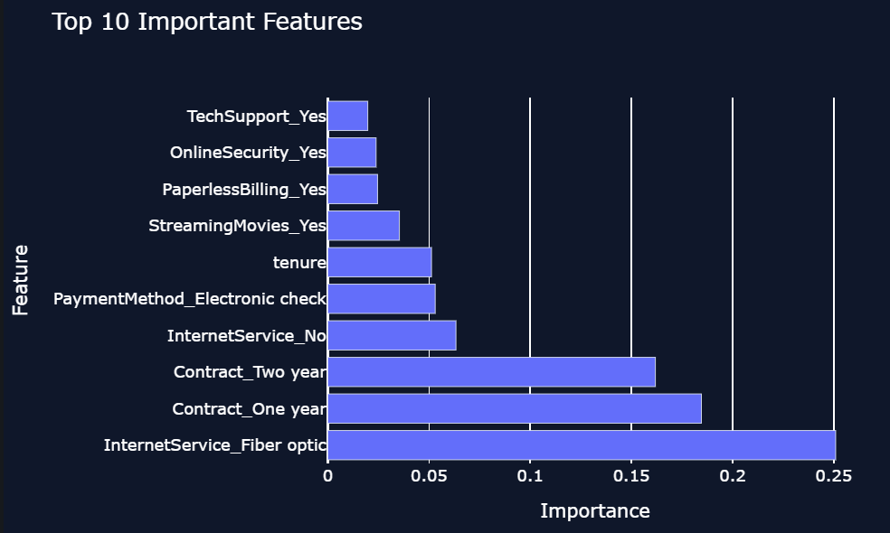
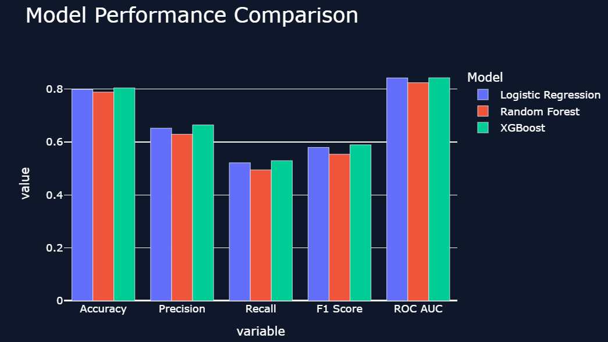

# 📊 AI Customer Churn Intelligence System

### AI-Powered Customer Retention Analytics & Churn Prediction Platform for Strategic Business Decision-Making

 

 

### 🌐 Live Demo
### https://muhammad-wildan-nabila-core-ai-customer-churn-intelligence.streamlit.app/

---

### 🟢 Core Project (Data Science / Machine Learning)

---

# 🚀 Project Overview

Customer churn is one of the most critical business challenges in subscription-based industries such as telecommunications, SaaS, banking, insurance, and digital services. Losing customers directly impacts recurring revenue, acquisition costs, and long-term profitability.

This project presents an end-to-end AI-powered churn intelligence system designed to:

- Predict customer churn probability
- Segment customers based on churn risk
- Generate strategic retention insights
- Visualize business intelligence interactively
- Support data-driven decision-making

The platform combines machine learning, predictive analytics, and executive-level business visualization into a modern enterprise-style dashboard.

---

# 🎯 Business Objectives

This system was developed to help businesses:

✅ Detect high-risk customers early  
✅ Improve customer retention strategy  
✅ Reduce revenue leakage caused by churn  
✅ Understand key churn-driving factors  
✅ Prioritize retention campaigns efficiently  
✅ Support executive-level analytical reporting  

---

# 🧠 Core AI Capabilities

- AI-Based Customer Churn Prediction
- Risk-Level Classification
- Interactive Churn Probability Analysis
- Customer Risk Segmentation
- Explainable AI using Feature Importance
- Business Recommendation Engine
- Executive Business Dashboard
- Machine Learning Model Comparison

---

# 🖥️ Executive Dashboard

The executive dashboard provides a comprehensive overview of customer retention performance, churn segmentation, and strategic business indicators.

### Key Metrics:
- Total Customers
- High-Risk Customers
- Average Churn Risk
- Retention Priority Rate

### Dashboard Features:
- Real-time KPI Visualization
- Customer Risk Segmentation
- Churn Probability Analysis
- Feature Importance Analytics
- Strategic Business Insight

---

# 🤖 AI Prediction System

The AI Prediction System enables interactive customer churn prediction using machine learning models trained on historical customer behavior data.

### Prediction Inputs:
- Customer Tenure
- Monthly Charges
- Total Charges
- Contract Type
- Internet Service
- Payment Method
- Paperless Billing
- Senior Citizen Status

### Prediction Outputs:
- Churn Probability Score
- Risk Classification
- Business Recommendation
- Strategic Retention Action

---

# 📈 Customer Risk Distribution

The churn segmentation analysis classifies customers into multiple risk categories:

| Risk Level | Description |
|---|---|
| 🟢 Low Risk | Customers likely to stay |
| 🟡 Medium Risk | Customers requiring monitoring |
| 🔴 High Risk | Customers with high churn probability |

This segmentation supports targeted retention strategy and customer prioritization.

---

# 🧠 Explainable AI — Feature Importance

To improve interpretability and business understanding, the system analyzes the most influential variables affecting churn behavior.

### Most Influential Features:
- Internet Service Type
- Contract Duration
- Payment Method
- Customer Tenure
- Streaming Services
- Paperless Billing

This explainability layer enables businesses to understand *why* customers churn, not just *who* will churn.

---

# 📊 Machine Learning Model Comparison

Multiple machine learning algorithms were evaluated to identify the most effective predictive model.

---

# 🏆 Model Evaluation Results

| Model | Accuracy | Precision | Recall | F1 Score | ROC-AUC |
|---|---|---|---|---|---|
| Logistic Regression | 0.7991 | 0.6522 | 0.5214 | 0.5795 | 0.8420 |
| Random Forest | 0.7885 | 0.6293 | 0.4947 | 0.5539 | 0.8240 |
| XGBoost | **0.8041** | **0.6644** | **0.5294** | **0.5893** | **0.8425** |

---

# 📌 Model Performance Analysis

The XGBoost model achieved the strongest overall performance across multiple evaluation metrics.

### Key Findings:
- Highest Accuracy Score
- Best Precision Performance
- Strongest F1 Score
- Highest ROC-AUC Score
- Better generalization capability

The model demonstrates strong capability in identifying potential churn customers while maintaining balanced predictive performance.

---

# 🛠️ Tech Stack

| Category | Technologies |
|---|---|
| Programming Language | Python |
| Machine Learning | Scikit-Learn, XGBoost |
| Data Processing | Pandas, NumPy |
| Visualization | Plotly, Matplotlib |
| Dashboard Framework | Streamlit |
| Model Evaluation | ROC-AUC, F1 Score |
| Deployment | Streamlit Cloud |

---

# 📌 Industrial Relevance

This project reflects real-world business intelligence and predictive analytics use cases commonly implemented in:

- Telecommunications Industry
- SaaS Companies
- Banking & Financial Services
- Insurance Companies
- E-Commerce Platforms
- Subscription-Based Businesses

The system demonstrates practical implementation of machine learning for customer retention optimization and strategic analytics.

---

# 💼 Portfolio Value

This project highlights competencies in:

- Machine Learning Engineering
- Predictive Analytics
- Business Intelligence
- Customer Analytics
- Data Visualization
- AI-Based Decision Support
- Executive Dashboard Development
- Explainable Artificial Intelligence

---

# 📊 Strategic Business Insights

### Key Business Findings:
- Customers with month-to-month contracts have significantly higher churn probability.
- Long-term contracts strongly reduce churn risk.
- Customers using fiber optic internet services show higher churn behavior.
- High monthly charges correlate with increased churn probability.
- Customer tenure plays a critical role in retention stability.

### Strategic Recommendations:
- Prioritize retention campaigns for high-risk customers.
- Offer long-term contract incentives.
- Improve onboarding experience for new customers.
- Create loyalty programs for medium-risk segments.
- Develop personalized retention strategies using churn prediction scores.

---

# 👨‍💻 Author

| Name | Role |
|---|---|
| Muhammad Wildan Nabila | Machine Learning & Data Science Developer |

---

# ⭐ Final Notes

This project was developed as an industrial-style AI analytics platform focused on customer retention intelligence and predictive business strategy.

The system combines:
- modern dashboard engineering,
- machine learning experimentation,
- explainable AI,
- and executive-level business visualization

into a single integrated analytical platform.

The project demonstrates how machine learning can support strategic business decision-making through intelligent churn analysis and predictive customer retention systems.

---

### ⭐ If you find this project valuable, feel free to star the repository.

